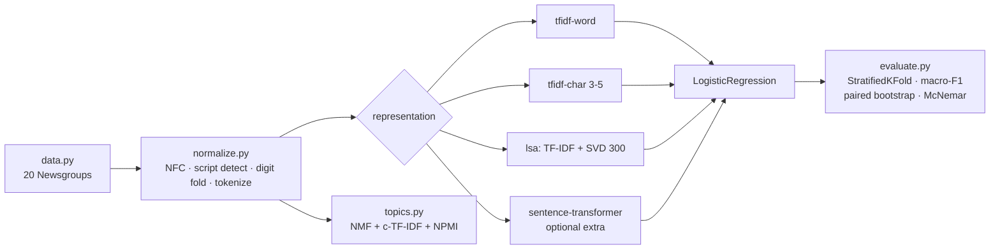

# Classical NLP Baselines

> TF-IDF vs LSA vs sentence embeddings on 20 Newsgroups, Indic-aware text normalisation, and NMF + c-TF-IDF topics — with the evaluation set up so the answer is allowed to be "no significant difference".

[](https://github.com/Prithv122/classical-nlp/actions/workflows/ci.yml)

**Live demo:** _not deployed — a CLI, runs locally (see §6)_
**Stack:** Python 3.12 · scikit-learn · numpy · scipy · pytest · ruff · GitHub Actions
(`sentence-transformers` is an optional extra, not a dependency)

---

## 1. The problem

Before anyone reaches for an embedding model or an API, two questions should be answered
with numbers: *does the expensive representation actually beat TF-IDF on this corpus*, and
*is the pipeline even reading the text correctly*. Both are usually skipped. This project
answers them: three representations compared with confidence intervals rather than a
leaderboard of single numbers, a text-normalisation layer that handles Devanagari and
Kannada rather than silently mangling them, and a topic model scored by coherence instead
of eyeballed word lists.

## 2. The data

| | |
|---|---|
| Source | **20 Newsgroups** via `sklearn.datasets.fetch_20newsgroups` (4 groups) |
| Size | 2,082 documents after filtering — hockey 568 · space 572 · christian 587 · religion.misc 355 |
| Licence | Public dataset, distributed with scikit-learn; downloaded and cached at first run |
| Preprocessing | `remove=('headers','footers','quotes')`, documents under 40 characters dropped |

Loading with `remove=(...)` is a correctness decision, not tidiness: the headers contain
the newsgroup name, so a model trained on the raw version learns to read the label off the
document and scores in the high nineties having learned nothing.

The multilingual side is **six hand-written sentences** in Hindi, Kannada and English.
They exercise the normalisation and tokenisation paths and **no accuracy number is
computed from them** — a dozen sentences cannot support one. A real Indic classification
benchmark is the top item in `NOTES.md` → Open questions.

## 3. Architecture



Every representation is a scikit-learn `Pipeline`, so `cross_val_predict` fits the
vectorizer inside each fold. The classifier is the same for all of them — the comparison
is of features, not of hyperparameter luck.

## 4. Key decisions & tradeoffs

| Decision | Chose | Over | Why |
|---|---|---|---|
| Word-character classification | Unicode general category (L/N/M) | `re` with `[^\w\s]` | Python's `\w` **excludes combining marks**, so the obvious punctuation strip deletes every Devanagari vowel sign. `क़िला` became `क ल` and nothing errored |
| Unicode form | NFC | NFKC | NFC merges the two encodings of `क़` (precomposed vs base+nukta) that render identically and hash differently. NFKC also rewrites lookalikes, which is lossy |
| Zero-width characters | Strip ZWSP/BOM/soft hyphen, **keep** ZWNJ/ZWJ | Strip all invisibles | ZWNJ is what stops a Devanagari half-form joining into a conjunct — removing it changes the word |
| Headline metric | Macro-F1 + per-class F1 | Accuracy | Accuracy 0.845 hides `talk.religion.misc` at F1 0.547 with recall 0.392 |
| Model comparison | Paired bootstrap CI **and** McNemar | The higher number wins | They can disagree, and the disagreement is informative (see §5) |
| Topic labels | c-TF-IDF, hand-written | BERTopic | The catalogue names BERTopic; it is embed → cluster → c-TF-IDF, and the third step is the one that decides whether topics are readable. Tier 1's stated purpose is "fundamentals below the API layer" |
| Stopwords for topics | Removed for topic modelling, **not** for classification | One rule for both | TF-IDF *weights* common words down, so a classifier copes. c-TF-IDF counts raw frequencies, so an unfiltered run labels all eight topics "the, of, to" |
| `sentence-transformers` | Optional extra with a lazy import | Required dependency | 90 MB of weights and a torch dependency, for the one representation that turns out not to be needed to make the point |
| Stoplists (hi/kn) | Short, hand-written | A borrowed 500-word list | Imports someone else's judgement about a language this project handles at the surface |

## 5. Results

All numbers from `uv run classical-nlp compare` / `leakage` / `topics` on the corpus in §2,
5-fold stratified CV, `LogisticRegression` on every representation.

**Representations** — the headline is that they tie:

| Representation | Macro-F1 | Fold sd | Accuracy |
|---|---|---|---|
| lsa (TF-IDF → SVD 300) | **0.8123** | 0.0191 | 0.8482 |
| tfidf-word | 0.8035 | 0.0155 | 0.8449 |
| tfidf-char (3–5, word-bounded) | 0.7923 | 0.0147 | 0.8381 |

lsa − tfidf-word = **+0.0088 macro-F1, 95% CI [−0.0051, +0.0223], bootstrap p = 0.22**;
McNemar: lsa alone correct on 68 items, tfidf-word alone on 61, **p = 0.60**. Both tests
agree here: **there is no evidence that the dense representation is better on this corpus.**
That is the useful result. Reporting "LSA wins, 0.812 vs 0.804" would have been true and
misleading.

(On an 800-document subset the two tests *disagreed* — tfidf-char beat lsa by +0.019 with a
bootstrap CI spanning zero, p = 0.22, while McNemar gave p = 0.0008 on 63 vs 30 discordant
items. Not a contradiction: McNemar tests per-item correctness, where the win was real and
consistent; the bootstrap tests macro-F1, which is dominated by the small hard class where
both models are noisy. Knowing which question each test answers is the point of running
both.)

**Where the errors are** (tfidf-word, per class):

| Class | Precision | Recall | F1 |
|---|---|---|---|
| rec.sport.hockey | 0.956 | 0.952 | 0.954 |
| sci.space | 0.826 | 0.962 | 0.889 |
| soc.religion.christian | 0.759 | 0.901 | 0.824 |
| **talk.religion.misc** | 0.908 | **0.392** | **0.547** |

154 of 355 `talk.religion.misc` documents are predicted as `soc.religion.christian`. The
model is precise but timid on the hard class — accuracy 0.845 says none of this.

**Leakage, measured rather than asserted** (inflation = leaky − honest macro-F1):

| Step fitted outside the folds | n = 400 | n = 2,082 |
|---|---|---|
| TF-IDF (unsupervised) | +0.0011 | +0.0025 |
| chi² top-300 feature selection (**supervised**) | **+0.0288** | +0.0052 |

The common warning is "always fit the vectorizer inside the fold". Measured here, that leak
is worth ~0.002 macro-F1 — because a vectorizer never sees a label; it only learns
vocabulary and IDF. The leak that actually costs you is a **supervised** step: chi-squared
selection fitted on all labels inflates by 0.029 at n = 400, more than ten times as much,
and the effect shrinks as the corpus grows. Both are kept inside the pipeline here; the
difference is worth knowing when triaging someone else's notebook.

**Topic modelling** (NMF over TF-IDF, c-TF-IDF labels, NPMI coherence):

| Configuration | NPMI coherence | Sample labels |
|---|---|---|
| First attempt: no stoplist, `log(1 + corpus_total/f)` | 0.2132 | `the, of, to, is` · `the, of, and, to` · `you, i, to, the` |
| Fixed: stoplist + `log(1 + avg_words_per_topic/f)` | **0.3611** | `god, jesus, christ, bible` · `space, nasa, launch, earth` · `team, players, season, hockey` |

Same corpus, same NMF, same number of topics — the labels went from useless to readable by
correcting the c-TF-IDF weighting and removing stopwords. Coherence is what caught it;
without a number, "the, of, to" and "god, jesus, christ" both look like *some* output. At
16 topics coherence is 0.3619 — no better, so 8 is the size to keep.

**Engineering:** 38 tests (network-dependent ones marked `network`), ruff clean, CI on
every push.

## 6. How to run

```bash
git clone https://github.com/Prithv122/classical-nlp.git
cd classical-nlp
uv sync
uv run pytest -m "not network"     # offline subset
uv run pytest                      # everything (downloads 20 Newsgroups once, ~14 MB)

uv run classical-nlp normalize                      # the Indic normalisation walkthrough
uv run classical-nlp compare --detail               # the table above, plus confusion matrix
uv run classical-nlp leakage --supervised --k 300   # both leakage numbers
uv run classical-nlp topics --n-topics 8            # topics + NPMI coherence

# Optional, adds the pretrained-embedding row (90 MB download, pulls torch):
uv sync --extra embeddings
uv run classical-nlp compare --models tfidf-word sentence-transformer
```

`--limit N` restricts the corpus for a quick look. No accounts, no API keys, no env vars.

## 7. What I'd change at 100× scale

At ~200k documents the pipeline changes shape in three places:

1. **`TfidfVectorizer` holds the vocabulary in memory and needs a full pass.**
   `HashingVectorizer` + `SGDClassifier` with `partial_fit` streams instead, at the cost of
   losing IDF and inspectable feature names — which is a real cost when the per-class error
   analysis above is how you find out what is broken.
2. **The bootstrap becomes the bottleneck, not the model.** 2,000 resamples × macro-F1 over
   200k items is minutes per comparison. I would bootstrap over a fixed held-out sample, or
   switch to an approximate randomisation test with early stopping.
3. **NMF over a 200k × 500k matrix does not fit.** Online NMF or, more likely, the actual
   BERTopic route — embed, reduce with UMAP, cluster with HDBSCAN — with c-TF-IDF still
   doing the labelling, since that part scales fine and is already written here.

The normalisation layer is the one part that scales unchanged; it is per-document and
O(characters).

---

## References

- 20 Newsgroups via scikit-learn's `fetch_20newsgroups`; the `remove=` argument and its
  rationale are documented in the scikit-learn user guide.
- c-TF-IDF is the term-weighting scheme introduced by BERTopic (Grootendorst, 2022). The
  implementation here is written from the description — `tf × log(1 + A/f)`, with A the
  average words per topic — not copied; the library itself is deliberately not a dependency.
- NPMI coherence follows Bouma (2009); computed over this corpus's own document
  co-occurrence.
