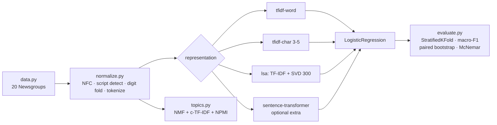
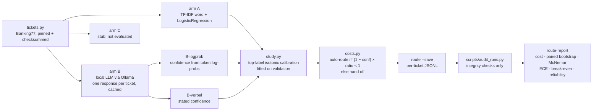
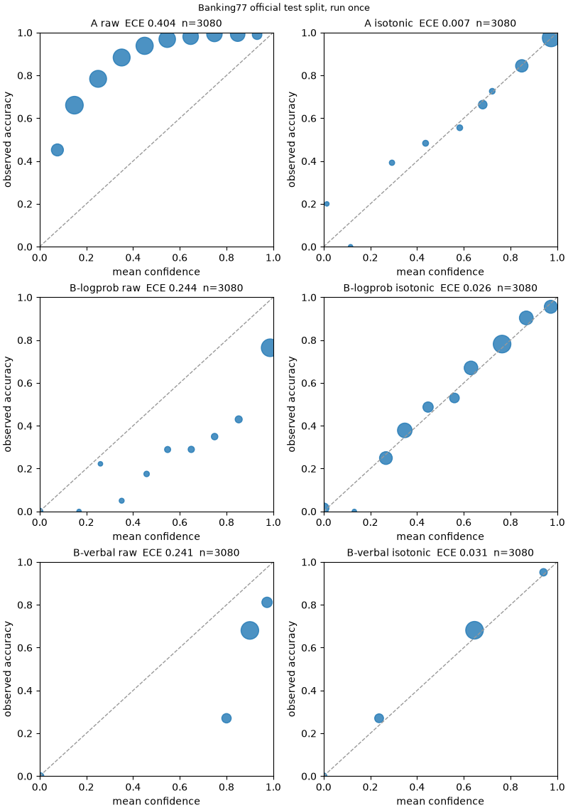

# Classical NLP Baselines

> TF-IDF vs LSA vs sentence embeddings on 20 Newsgroups, Indic-aware text normalisation, NMF + c-TF-IDF topics, and a cost-priced, held-out comparison of a TF-IDF ticket router against a local 7B LLM router on Banking77 — each evaluation set up so the answer is allowed to come out either way.

[](https://github.com/Prithv122/classical-nlp/actions/workflows/ci.yml)

**Live demo:** _not deployed — a CLI, runs locally (see §6)_
**Stack:** Python 3.12 · scikit-learn · numpy · scipy · pytest · ruff · GitHub Actions.
Router study only: a local [Ollama](https://ollama.com) server for the LLM arm, and
matplotlib for reliability diagrams (the optional `router` extra).
`sentence-transformers` is an optional extra, not a dependency.

**Router study headline** (official Banking77 test split, run once): at a 10:1
misroute-to-handoff cost ratio, the calibrated TF-IDF router cost **589.0** handoff-units per
1,000 tickets against **939.0** for a calibrated local 7B LLM router — difference −350.0, 95% CI
[−397.7, −299.3], p < 0.001, excluding compute. Details, mechanism and limits in §5.

---

## 1. The problem

Before anyone reaches for an embedding model or an API, two questions should be answered
with numbers: *does the expensive representation actually beat TF-IDF on this corpus*, and
*is the pipeline even reading the text correctly*. Both are usually skipped. This project
answers them: three representations compared with confidence intervals rather than a
leaderboard of single numbers, a text-normalisation layer that handles Devanagari and
Kannada rather than silently mangling them, and a topic model scored by coherence instead
of eyeballed word lists.

The second part asks the question teams now ask about LLMs: **should a support ticket be
routed by a small supervised classifier or by an LLM?** Accuracy does not answer it, because
a router can also decline and hand the ticket to a human. The router study prices every
decision — a handoff costs 1 unit, a misroute costs `ratio` units (10 at the headline) — and
compares the arms on routing decision cost per 1,000 tickets. The evaluation protocol was
committed (`FINAL_EVAL.md`) before the held-out test split was scored, and the test split was
run once.

## 2. The data

| | |
|---|---|
| Source | **20 Newsgroups** via `sklearn.datasets.fetch_20newsgroups` (4 groups) |
| Size | 2,082 documents after filtering — hockey 568 · space 572 · christian 587 · religion.misc 355 |
| Licence | Public dataset, distributed with scikit-learn; downloaded and cached at first run |
| Preprocessing | `remove=('headers','footers','quotes')`, documents under 40 characters dropped |

Loading with `remove=(...)` is a correctness decision, not tidiness: the headers contain
the newsgroup name, so a model trained on the raw version learns to read the label off the
document and scores in the high nineties having learned nothing.

The multilingual side is **six hand-written sentences** in Hindi, Kannada and English.
They exercise the normalisation and tokenisation paths and **no accuracy number is
computed from them** — a dozen sentences cannot support one. A real Indic classification
benchmark is the top item in `NOTES.md` → Open questions.

**Router study — Banking77:**

| | |
|---|---|
| Source | **Banking77** (PolyAI): online-banking customer queries, upstream CSVs pinned to commit `57ec275`, SHA-256 checked on every load |
| Size | 13,083 queries, 77 intents; official split 10,003 train / 3,080 test |
| Splits used | Validation = seeded, stratified 20% of train (2,001 tickets); the routers are fitted on the other 8,002. The official test split is the held-out evaluation, scored once |
| Licence | CC-BY-4.0 — Casanueva et al. (2020), arXiv:2003.04807 |

The download goes to the pinned upstream CSVs rather than Hugging Face, whose Banking77
repository holds only a loading script that current `datasets` refuses to run. A 60-row
hand-written fixture (`--fixture`) exercises the code paths; it is not Banking77 data and no
result comes from it.

## 3. Architecture


```mermaid
flowchart LR
    A[data.py<br/>20 Newsgroups] --> B[normalize.py<br/>NFC · script detect · digit fold · tokenize]
    B --> C{representation}
    C --> D[tfidf-word]
    C --> E[tfidf-char 3-5]
    C --> F[lsa: TF-IDF + SVD 300]
    C --> G[sentence-transformer<br/>optional extra]
    D & E & F & G --> H[LogisticRegression]
    H --> I[evaluate.py<br/>StratifiedKFold · macro-F1<br/>paired bootstrap · McNemar]
    B --> J[topics.py<br/>NMF + c-TF-IDF + NPMI]
```

Every representation is a scikit-learn `Pipeline`, so `cross_val_predict` fits the
vectorizer inside each fold. The classifier is the same for all of them — the comparison
is of features, not of hyperparameter luck.

**Router study:**


```mermaid
flowchart LR
    T[tickets.py<br/>Banking77, pinned + checksummed] --> A[arm A<br/>TF-IDF word + LogisticRegression]
    T --> B[arm B<br/>local LLM via Ollama<br/>one response per ticket, cached]
    T -.-> C[arm C<br/>stub: not evaluated]
    B --> BL[B-logprob<br/>confidence from token log-probs]
    B --> BV[B-verbal<br/>stated confidence]
    A & BL & BV --> S[study.py<br/>top-label isotonic calibration<br/>fitted on validation]
    S --> R["costs.py<br/>auto-route iff (1 − conf) × ratio &lt; 1<br/>else hand off"]
    R --> F["route --save<br/>per-ticket JSONL"]
    F --> AU[scripts/audit_runs.py<br/>integrity checks only]
    AU --> RP[route-report<br/>cost · paired bootstrap · McNemar<br/>ECE · break-even · reliability]
```

Every arm returns `(label, confidence)` through one contract, and calibration is a study step
applied identically to every arm rather than part of any arm. Arm B's two variants read the
**same** model response, so only the confidence signal differs between them. Arm C (a
dedicated decision model) is registered but not built; it is reported as not evaluated and
never estimated.

## 4. Key decisions & tradeoffs

| Decision | Chose | Over | Why |
|---|---|---|---|
| Word-character classification | Unicode general category (L/N/M) | `re` with `[^\w\s]` | Python's `\w` **excludes combining marks**, so the obvious punctuation strip deletes every Devanagari vowel sign. `क़िला` became `क ल` and nothing errored |
| Unicode form | NFC | NFKC | NFC merges the two encodings of `क़` (precomposed vs base+nukta) that render identically and hash differently. NFKC also rewrites lookalikes, which is lossy |
| Zero-width characters | Strip ZWSP/BOM/soft hyphen, **keep** ZWNJ/ZWJ | Strip all invisibles | ZWNJ is what stops a Devanagari half-form joining into a conjunct — removing it changes the word |
| Headline metric | Macro-F1 + per-class F1 | Accuracy | Accuracy 0.845 hides `talk.religion.misc` at F1 0.547 with recall 0.392 |
| Model comparison | Paired bootstrap CI **and** McNemar | The higher number wins | They can disagree, and the disagreement is informative (see §5) |
| Topic labels | c-TF-IDF, hand-written | BERTopic | The catalogue names BERTopic; it is embed → cluster → c-TF-IDF, and the third step is the one that decides whether topics are readable. Tier 1's stated purpose is "fundamentals below the API layer" |
| Stopwords for topics | Removed for topic modelling, **not** for classification | One rule for both | TF-IDF *weights* common words down, so a classifier copes. c-TF-IDF counts raw frequencies, so an unfiltered run labels all eight topics "the, of, to" |
| `sentence-transformers` | Optional extra with a lazy import | Required dependency | 90 MB of weights and a torch dependency, for the one representation that turns out not to be needed to make the point |
| Stoplists (hi/kn) | Short, hand-written | A borrowed 500-word list | Imports someone else's judgement about a language this project handles at the surface |

**Router study:**

| Decision | Chose | Over | Why |
|---|---|---|---|
| Router metric | Routing decision cost per 1,000 tickets (handoff = 1, misroute = `ratio`), at ratios 2, 5, 10, 20 | Accuracy | A router can decline. Accuracy cannot see the trade between automating a ticket and handing it to a human, which is the decision being made |
| Routing rule | Auto-route iff (1 − confidence) × ratio < 1, else hand off | A tuned threshold | Follows from the costs, so nothing is tuned on any split; at 10:1 it means confidence above 0.9 |
| Calibration | Top-label isotonic, one study step for every arm, fitted on validation | Per-arm calibration or none | Same treatment for both arms; raw and isotonic results are both reported |
| LLM confidence | Two variants from one response: token log-probs and stated number | Two separate model calls | Isolates the confidence signal; the variants are an ablation, not two models |
| LLM output handling | Strict: the reply must name a listed intent exactly, no retry or repair | Fuzzy matching or constrained decoding | Measures the model as prompted. An unusable reply abstains, which costs a handoff and counts as wrong |
| LLM | `qwen2.5:7b-instruct` at 3-bit (q3_K_M), local via Ollama, temperature 0, response cache | A hosted API | No keys, and every response is cached so the run replays exactly. One configuration, which limits what the result covers |
| Compute | Excluded from cost; break-even reported instead | An assumed price per second or token | Any price would be invented. The break-even shows whether a price could change the answer |
| Held-out protocol | Protocol committed before the test split was scored; test run once; integrity audit before the report | Iterating on test | The comparison is only worth anything if the test split could not shape the method |
| Data source | Upstream CSVs pinned by commit and SHA-256 | Hugging Face `datasets` | The hub repository holds a loading script, not data, and current `datasets` refuses scripts |

## 5. Results

### Router study — Banking77 official test split, run once

Every number here is from the committed evidence in
[`results/final/report_test/`](results/final/report_test/) (hashes in
`results/final/SHA256SUMS`), produced under the protocol in [`FINAL_EVAL.md`](FINAL_EVAL.md).
The wording rules for these results are in [`results/final/CLAIMS.md`](results/final/CLAIMS.md).
n = 3,080 tickets. Costs are routing decision cost per 1,000 tickets in handoff units,
**excluding compute**. Bootstrap intervals are paired, 2,000 resamples, 95% percentile.

**Primary result (H1)** — 10:1 misroute-to-handoff ratio, isotonic calibration:

| Arm | Auto-routed | Misrouted | Cost per 1,000 |
|---|---|---|---|
| A — TF-IDF + logistic regression | 1,686 (54.7%) | 42 | **589.0** |
| B-logprob — local 7B LLM, log-prob confidence | 338 (11.0%) | 15 | **939.0** |

A − B = **−350.0, 95% CI [−397.7, −299.3], p < 0.001**. H1 ("A has lower cost than B at the
headline ratio"): A lower.

**A wins by automating far more tickets, not by misrouting fewer** — it misrouted 42 tickets
to B's 15. The calibrated LLM cleared the 0.9 confidence bar on only 11.0% of tickets and
handed the rest to a human.

Across the other ratios (reported comparisons, not hypotheses; not corrected for multiple
comparisons) A was lower than B-logprob at all four ratios under both calibrations, and all
eight intervals exclude zero. Isotonic: 2:1 −375.6 [−405.2, −346.1]; 5:1 −385.7
[−430.2, −339.6]; 20:1 −261.0 [−334.7, −186.4].

**Calibration (H2)** — top-label ECE:

| Arm | Raw ECE | Isotonic ECE |
|---|---|---|
| A | 0.404 (under-confident) | **0.007** |
| B-logprob | 0.244 (over-confident) | **0.026** |

After isotonic calibration, A − B = **−0.019, 95% CI [−0.030, −0.002], p = 0.027**: the
interval narrowly excluded zero, and H2 ("A has lower ECE than B") reads A lower. Both arms are
well calibrated after isotonic in absolute terms. **On raw confidences it runs the other way**
(+0.160 [+0.140, +0.179]): B-logprob's raw confidence was better calibrated, and A became the
better-calibrated arm only after the isotonic step.

Calibration also decided the costs (descriptive, no interval): A's 10:1 cost went from 970.1
with raw confidence to 589.0 with isotonic, and raw B-logprob at 5, 10 and 20:1 cost more
than handing every ticket to a human (1,255.8, 1,934.7 and 2,965.9 against 1,000).



**Accuracy, supporting** — exact McNemar, abstentions counted as wrong: 937 tickets only A got
right, 135 only B got right (exact p ≈ 3.0 × 10⁻¹⁴⁸). A was right on 802 more tickets, 26.0
percentage points of 3,080.

**Operational measurements:**

- B abstained — replied with something other than an exact listed intent — on 167 of 3,080
  tickets (5.4%); A never abstains.
- B model-side time per ticket: mean 4.15 s, p50 4.07 s, p95 5.59 s (model load excluded, one
  local machine). About 499 prompt tokens per ticket, 481 of them cached, and about 14 output
  tokens. A is timed in-process wall-clock, a different clock, so the two are not compared
  numerically.
- Break-even: B was not cheaper before compute in any of the 16 arm/calibration/ratio
  settings, so there is no compute price at which it breaks even.

**B-verbal (ablation).** B-verbal reads the same responses as B-logprob — identical predictions
(937 / 135 against A) and identical abstentions (167) — and differs only in using the stated
confidence. It is not a second, independent model. Isotonic ECE 0.031; 10:1 isotonic cost
954.5. The one comparison in the study with no clear difference is A against raw B-verbal at
20:1: −5.5 [−52.3, +38.0], p = 0.879. B-logprob and B-verbal were not compared with each other
statistically.

**Arm C** (dedicated decision model): not evaluated.

**What this does not show.**

- It is one LLM configuration: one 3-bit 7B model, zero-shot, one prompt, strict parsing. It
  is not evidence that TF-IDF beats LLMs in general.
- The supervision is unequal by design: A learned from 8,002 labelled tickets; B saw none.
- Compute is excluded: neither arm's inference is priced, and A's compute is not subtracted.
- Calibrators were not refitted inside bootstrap resamples; calibrated confidences are treated
  as fixed.
- One dataset (English, short queries, 77 intents), and the 10:1 ratio is an assumption, not a
  measured cost.

**Process.** The protocol was committed before the test split was scored. The test split was
run once; one interruption was logged and resumed under the protocol's continuation rule, and
the integrity audit (`scripts/audit_runs.py`) passed 14 of 14 checks before the report was
produced. Arm B's results can be replayed from its response cache.

### Representation study — 20 Newsgroups

All numbers from `uv run classical-nlp compare` / `leakage` / `topics` on the corpus in §2,
5-fold stratified CV, `LogisticRegression` on every representation.

**Representations** — the headline is that they tie:

| Representation | Macro-F1 | Fold sd | Accuracy |
|---|---|---|---|
| lsa (TF-IDF → SVD 300) | **0.8123** | 0.0191 | 0.8482 |
| tfidf-word | 0.8035 | 0.0155 | 0.8449 |
| tfidf-char (3–5, word-bounded) | 0.7923 | 0.0147 | 0.8381 |

lsa − tfidf-word = **+0.0088 macro-F1, 95% CI [−0.0051, +0.0223], bootstrap p = 0.22**;
McNemar: lsa alone correct on 68 items, tfidf-word alone on 61, **p = 0.60**. Both tests
agree here: **there is no evidence that the dense representation is better on this corpus.**
That is the useful result. Reporting "LSA wins, 0.812 vs 0.804" would have been true and
misleading.

(On an 800-document subset the two tests *disagreed* — tfidf-char beat lsa by +0.019 with a
bootstrap CI spanning zero, p = 0.22, while McNemar gave p = 0.0008 on 63 vs 30 discordant
items. Not a contradiction: McNemar tests per-item correctness, where the win was real and
consistent; the bootstrap tests macro-F1, which is dominated by the small hard class where
both models are noisy. Knowing which question each test answers is the point of running
both.)

**Where the errors are** (tfidf-word, per class):

| Class | Precision | Recall | F1 |
|---|---|---|---|
| rec.sport.hockey | 0.956 | 0.952 | 0.954 |
| sci.space | 0.826 | 0.962 | 0.889 |
| soc.religion.christian | 0.759 | 0.901 | 0.824 |
| **talk.religion.misc** | 0.908 | **0.392** | **0.547** |

154 of 355 `talk.religion.misc` documents are predicted as `soc.religion.christian`. The
model is precise but timid on the hard class — accuracy 0.845 says none of this.

**Leakage, measured rather than asserted** (inflation = leaky − honest macro-F1):

| Step fitted outside the folds | n = 400 | n = 2,082 |
|---|---|---|
| TF-IDF (unsupervised) | +0.0011 | +0.0025 |
| chi² top-300 feature selection (**supervised**) | **+0.0288** | +0.0052 |

The common warning is "always fit the vectorizer inside the fold". Measured here, that leak
is worth ~0.002 macro-F1 — because a vectorizer never sees a label; it only learns
vocabulary and IDF. The leak that actually costs you is a **supervised** step: chi-squared
selection fitted on all labels inflates by 0.029 at n = 400, more than ten times as much,
and the effect shrinks as the corpus grows. Both are kept inside the pipeline here; the
difference is worth knowing when triaging someone else's notebook.

**Topic modelling** (NMF over TF-IDF, c-TF-IDF labels, NPMI coherence):

| Configuration | NPMI coherence | Sample labels |
|---|---|---|
| First attempt: no stoplist, `log(1 + corpus_total/f)` | 0.2132 | `the, of, to, is` · `the, of, and, to` · `you, i, to, the` |
| Fixed: stoplist + `log(1 + avg_words_per_topic/f)` | **0.3611** | `god, jesus, christ, bible` · `space, nasa, launch, earth` · `team, players, season, hockey` |

Same corpus, same NMF, same number of topics — the labels went from useless to readable by
correcting the c-TF-IDF weighting and removing stopwords. Coherence is what caught it;
without a number, "the, of, to" and "god, jesus, christ" both look like *some* output. At
16 topics coherence is 0.3619 — no better, so 8 is the size to keep.

**Engineering:** 230 tests across both studies (the 3 network-dependent ones marked
`network`), ruff clean, CI on every push.

## 6. How to run

```bash
git clone https://github.com/Prithv122/classical-nlp.git
cd classical-nlp
uv sync
uv run pytest -m "not network"     # offline subset
uv run pytest                      # everything (downloads 20 Newsgroups once, ~14 MB)

uv run classical-nlp normalize                      # the Indic normalisation walkthrough
uv run classical-nlp compare --detail               # the table above, plus confusion matrix
uv run classical-nlp leakage --supervised --k 300   # both leakage numbers
uv run classical-nlp topics --n-topics 8            # topics + NPMI coherence

# Optional, adds the pretrained-embedding row (90 MB download, pulls torch):
uv sync --extra embeddings
uv run classical-nlp compare --models tfidf-word sentence-transformer
```

`--limit N` restricts the corpus for a quick look. No accounts, no API keys, no env vars.

**Router study** (validation split; the commands below never touch the test split):

```bash
uv sync --extra router                         # adds matplotlib for the reliability diagram
uv run classical-nlp route --arm A --fixture   # code path on the synthetic fixture, not a result
uv run classical-nlp tickets-download          # pinned Banking77 CSVs into data/raw/banking77
uv run classical-nlp route --arm A --data-dir data/raw/banking77 --save data/interim/runs_val_A.jsonl

# Arm B needs a local Ollama server with the model pulled. About 4 s of model time per
# ticket on the machine used here; every response is cached, so a re-run replays them:
ollama pull qwen2.5:7b-instruct-q3_K_M
uv run classical-nlp route --arm B --data-dir data/raw/banking77 --cache data/interim/llm_cache.jsonl --save data/interim/runs_val_B.jsonl

uv run classical-nlp route-report --runs data/interim/runs_val_A.jsonl data/interim/runs_val_B.jsonl --out data/interim/report_val
```

The official test split is scored once, by the commands in `FINAL_EVAL.md`; `route-report`
refuses test-split files without `--final`. The committed results can be checked against their
recorded hashes:

```bash
cd results/final && sha256sum -c --ignore-missing SHA256SUMS
```

## 7. What I'd change at 100× scale

At ~200k documents the pipeline changes shape in three places:

1. **`TfidfVectorizer` holds the vocabulary in memory and needs a full pass.**
   `HashingVectorizer` + `SGDClassifier` with `partial_fit` streams instead, at the cost of
   losing IDF and inspectable feature names — which is a real cost when the per-class error
   analysis above is how you find out what is broken.
2. **The bootstrap becomes the bottleneck, not the model.** 2,000 resamples × macro-F1 over
   200k items is minutes per comparison. I would bootstrap over a fixed held-out sample, or
   switch to an approximate randomisation test with early stopping.
3. **NMF over a 200k × 500k matrix does not fit.** Online NMF or, more likely, the actual
   BERTopic route — embed, reduce with UMAP, cluster with HDBSCAN — with c-TF-IDF still
   doing the labelling, since that part scales fine and is already written here.

The normalisation layer is the one part that scales unchanged; it is per-document and
O(characters).

For the router at 100× ticket volume:

4. **The LLM arm becomes a serving problem.** One local model answering one ticket at a time
   does not keep up; it needs batched inference on a dedicated server, and constrained
   decoding so that a reply is always a valid intent instead of abstaining.
5. **Compute needs a real price.** This study excludes it deliberately. At volume the cost
   rule would add a measured per-ticket inference cost for both arms, so the comparison prices
   the whole decision.
6. **Calibration has to be maintained.** The isotonic map was fitted once on validation. In
   production it would be refitted on a rolling labelled sample and ECE monitored, because
   the routing rule is only as good as the confidence it reads.

---

## References

- 20 Newsgroups via scikit-learn's `fetch_20newsgroups`; the `remove=` argument and its
  rationale are documented in the scikit-learn user guide.
- c-TF-IDF is the term-weighting scheme introduced by BERTopic (Grootendorst, 2022). The
  implementation here is written from the description — `tf × log(1 + A/f)`, with A the
  average words per topic — not copied; the library itself is deliberately not a dependency.
- NPMI coherence follows Bouma (2009); computed over this corpus's own document
  co-occurrence.
- Banking77: Casanueva et al. (2020), "Efficient Intent Detection with Dual Sentence
  Encoders", arXiv:2003.04807. CC-BY-4.0.
- Isotonic calibration follows Zadrozny & Elkan (2002); expected calibration error as in
  Guo et al. (2017), "On Calibration of Modern Neural Networks".
- `calibrate.py` is vendored from the author's earlier
  [fraud-calibrated](https://github.com/Prithv122/fraud-calibrated) project (MIT);
  the top-label helpers at the bottom are new here.
- Arm B runs Qwen2.5-7B-Instruct (Qwen team) through Ollama; neither is vendored.
